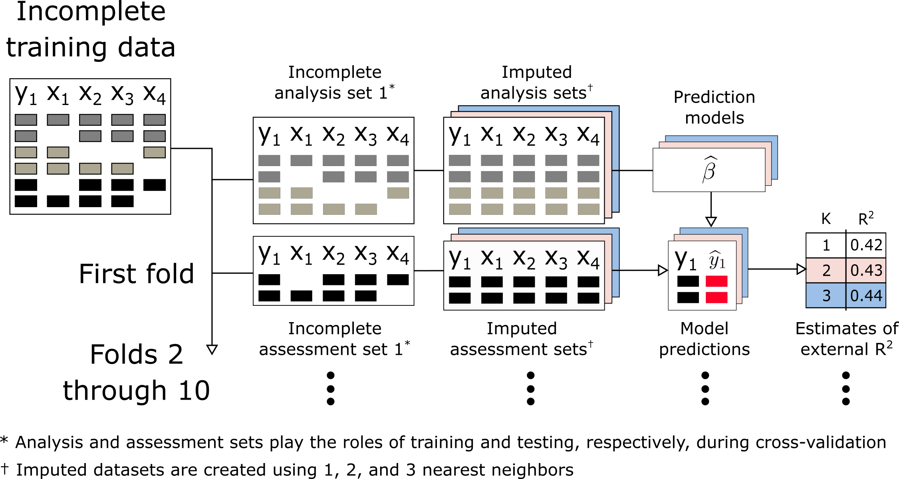

```{r, include = FALSE}

knitr::opts_chunk$set(echo = FALSE, message = FALSE)

# prevent scientific notation from printing 1ex for small / large numbers
options(scipen = 99999)


library(tidyverse)
library(tblStrings)
library(gt)

# general footnote for tables
mse_source_note <- 'All values are scaled by 100 for convenience'

sim_desc <- read_rds('../results/02-sim_descriptives.rds')
sim_tbls <- read_rds('../results/03-sim_tabulate.rds')

scenario_recode <- function(x)
  str_replace(x, pattern = '^S', replacement = 'Scenario ')


```

```{r, external-R-squared-table}  

tbl_ex_rsq <- sim_tbls$data_mse %>% 
  mutate(
    external = 100 * pointErr(external_mn, external_sd, style = 'brac'),
    cv_diffs = 100 * pointErr(abs_diff_mn, abs_diff_sd, style = 'brac')
  ) %>% 
  mutate_if(is_pointErr, as.character) %>% 
  select(key, nobs, ncov, external) %>% 
  pivot_wider(names_from = key, values_from = external) %>% 
  rename_at(vars(contains('_')), toupper) %>% 
  rename_at(vars(contains('_')), scenario_recode) %>% 
  gt(rowname_col = 'nobs', groupname_col = 'ncov') %>% 
  tab_spanner_delim(delim = '_') %>% 
  tab_source_note(mse_source_note) %>% 
  as_latex()

```

```{r, absolute-difference-between-cv-table}

tbl_abs_diff <- sim_tbls$data_mse %>% 
  mutate(
    external = 100 * pointErr(external_mn, external_sd, style = 'brac'),
    cv_diffs = 100 * pointErr(abs_diff_mn, abs_diff_sd, style = 'brac'),
  ) %>% 
  mutate_if(is_pointErr, as.character) %>% 
  select(key, nobs, ncov, cv_diffs) %>% 
  pivot_wider(
    names_from = key, 
    values_from = cv_diffs
  ) %>% 
  rename_at(vars(contains('_')), toupper) %>% 
  rename_at(vars(contains('_')), scenario_recode) %>% 
  gt(rowname_col = 'nobs', groupname_col = 'ncov') %>% 
  tab_spanner_delim(delim = '_') %>% 
  tab_source_note(mse_source_note) %>% 
  as_latex()

```

```{r, computational-overhead-table}

tbl_cmp_times <- sim_tbls$data_cmp %>% 
  ungroup() %>% 
  mutate(diff_rel = pointErr(diff_rel_mn, diff_rel_sd, style = 'brac')) %>% 
  select(key, nobs, ncov, action, diff_rel) %>%
  mutate_if(is_pointErr, as.character) %>% 
  pivot_wider(names_from = c(action, key), values_from = diff_rel) %>% 
  select(nobs, ncov, ends_with('1'), ends_with('2'), ends_with('3')) %>% 
  gt(rowname_col = 'nobs', groupname_col = 'ncov') %>%
  tab_stubhead(label = html('Observations </br> in training set')) %>%
  tab_spanner(
    columns = vars(make_s1, mdl_s1),
    label = "Scenario 1"
  ) %>%
  tab_spanner(
    columns = vars(make_s2, mdl_s2),
    label = "Scenario 2"
  ) %>%
  tab_spanner(
    columns = vars(make_s3, mdl_s3),
    label = "Scenario 3"
  ) %>%
  cols_label(
    make_s1 = 'Impute',
    mdl_s1  = 'Fit',
    make_s2 = 'Impute',
    mdl_s2  = 'Fit',
    make_s3 = 'Impute',
    mdl_s3  = 'Fit'
  )

```

# Introduction

<!-- Welcome! please feel free to make edits and submit pull requests. -->

In evaluating the performance of complex predictive models, it is now well understood that so-called training error (the predictive error measured on observations used to fit the model) is a poor proxy for generalization error (the performance of the model on future, as-yet-unseen, observations). The training error of a model will often be overly optimistic for the generalization error. For more complex modeling procedures (or on high dimensional data) this over-optimism can be quite substantial. As such, it is now standard to use sample-splitting methods to estimate generalization error. These methods train and evaluate models on separate data. Cross-validation (CV) is a common sample-splitting technique that repeatedly splits a single dataset into training and validation subsets to efficiently estimate generalization error. 

For multi-step modeling procedures, it is recommended that the entire sequence of steps be carried out during each replicate of CV to mimic the application of the entire procedure to an independent test set. This is particularly important for supervised steps (those steps that use the outcome variable). It is thought that most unsupervised steps (\ie steps that do not access information about outcome variables) can be completed before conducting CV with only minimal bias. This has been empirically validated for PCA and variance-based dimension reduction, ??? (we need to fill in some stuff here)

Missing data (MD) occur frequently in applied settings, and several machine learning algorithms (e.g., regression) are incompatible with MD. Imputation is a technique that replaces MD with estimated values. Imputation of MD is often one of the most computationally expensive steps in modeling procedures. For example, the \texttt{missForest} imputation algorithm may fit one random forest model for each column that contains MD. Computational expense of applying \texttt{missForest} or other imputation strategies with similar complexity during each replicate of CV scales poorly to larger datasets and to higher numbers of replications. High computational cost may lead analysts to prefer more convenient but less effective strategies to handle MD. A more computationally efficient approach would be to implement `unsupervised imputation' (\ie imputing MD without accessing outcome information) \emph{before} conducting CV. However, there is a lack of evidence substantiating the claim that unsupervised imputation conducted before CV will provide reliable estimates of a multi-step modeling procedure's generalization error. More importantly, there is a lack of evidence outlining scenarios when unsupervised imputation before CV can lead to biased estimates of model error. 

In this manuscript, we identify scenarios when reliable model error estimates can (or cannot) be computed using unsupervised imputation \emph{before} CV (a strategy we will refer to as \icv). We compare estimated model error according to \icv\space with estimated model error when imputation is applied \emph{during each replicate} of CV (a strategy hereafter referred to as \cvi). To objectively compare the accuracy of model error estimates using \icv\space and \cvi, we compute `true' model error using an external validation set with MD. Both simulated and real data are leveraged to draw these comparisons. Our analysis also introduces and applies the \texttt{ipa} R package (\textbf{i}mputation for \textbf{p}redictive \textbf{a}nalytics), which provides functions to create single or multiple imputed training and testing sets for prediction modeling. 

The rest of this manuscript is organized as follows. In Section \ref{sec:app}, we summarize results from experiments using real data from public repositories. Results are summarized alongside our recommendations for applied practice in Section \ref{sec:discuss}

\section{Missing data and cross-validation} \label{sec:mdcv}

<!-- % P1 discuss types of missing data: MCAR / MAR / MNAR -->
<!-- %  1. MCAR (no bias, but efficiency) -->
<!-- %  2. MAR (remove bias by imputing features) -->
<!-- %  3. MNAR (need to go beyond imputation; not touching this) -->

MD mechanisms were first formalized by Rubin, who developed a framework to analyze MD that supposes each data point has some probability of being missing. If the probability of missingness is unrelated to the data (\ie all data are equally likely to be missing), then the data are missing completely at random (MCAR). When the probability of missingness is related to observed variables in the data (\ie all data within observed groups are equally likely to be missing), the data are missing at random (MAR). If the probability of missingness is determined by reasons that are unknown or unobserved, the data are missing not at random (MNAR). To illustrate, if a doctor did not run labs for a patient because the clinic was too crowded at the time, the patient's data are MCAR. If instead the doctor chose not to measure the patient's labs because the patient was too young, the patient's data are MAR. If the patient missed the appointment because the patient was too sick, the patient's data are MNAR. In the context of statistical learning, previous findings have shown that when data are MNAR, imputation alone is often less efficient than incorporating features that characterize missing patterns (\eg missingness incorporated as an attribute)[@twala2008good; @twala2009empirical; @tang2017random]. Since the primary aim of the current study is to assess the differences between two implementations of imputation (\ie \icv\space and \cvi), we focus analyses on cases where data are MAR or MCAR.  

<!-- % P2 workflow for engaging with missing data for inferential analysis -->
<!-- %  1. imputation and multiple imputation for regression -->
<!-- %     - note propensity scores; we aren't touching this -->
<!-- %  2. inference imputation focuses on obtaining valid test statistics -->

The mechanisms of MD and methods to engage with MD have been studied thoroughly in the context of statistical inference. The primary focus in this setting is to obtain valid test statistics for statistical hypotheses in the presence of MD. Imputation to the mean and, more broadly, MD strategies that create a single imputed value, have been shown to increase type I errors for inferential statistics by artificially reducing the variance of observed data and ignoring the uncertainty attributed to MD, respectively. Multiple imputation, a widely recommended strategy to handle MD for statistical inference, is capable of producing valid test statistics when data are MCAR or MAR because it can simultaneously address the two shortcomings listed in the previous sentence. It is notable that the `accuracy' of imputed values is not critical for the success of multiple imputation, given sufficient estimates of conditional distributions [@van2018flexible]. Instead, it is the consistency of the estimated covariance matrix for regression coefficients that makes this strategy ideal for statistical inference. 

<!-- % Byron finish these by next meeting (April 20th) -->

<!-- % P3 predictive modeling -->
<!-- %  1. prediction imputation focuses on prediction accuracy for new data -->
<!-- %    - introduce predictive modeling  -->
<!-- %    - introduce the paradigm of tuning parameters -->
<!-- %    - introduce cross-validation and generalization error -->

In the context of supervised statistical learning, data often include a training set and an external validation set. commonly ordered steps for model development are (1) data pre-processing, (2) tuning model hyper-parameters, (3) training the model(s) on the full training set, and (4) validating the model(s) using the validation set. Handling MD is a pre-processing task conducted in the training and validation sets, separately. In contrast to statistical inference, single imputation is often used in supervised learning workflows and strategies with greater imputation 'accuracy' are preferred. When $k$-fold CV is applied, the training data are split into $k$ non-overlapping subsets (\ie folds). Each fold is then used as a testing set for the model(s) developed on the $k-1$ other folds. Aggregating model errors over all $k$ steps provides an estimate of the modeling procedure's generalization error, making $k$-fold CV an ideal resampling technique for tuning model hyper-parameters or comparing different modeling procedures. To mimic the application of the entire modeling procedure to an independent validation set, it is recommended that all data pre-processing steps be executed in each replicate of CV. Following CV, the generalization error of the modeling procedure(s) is measured by applying the 'tuned' modeling procedure to the entire training set and then evaluating the resulting prediction function's accuracy in the external validation set. 

<!-- % additional text that I left of the previous paragraph: Although multiple imputation has been shown to increase the prediction accuracy of downstream models, the computational overhead of multiple imputation is not ideal. It is generally assumed that the accuracy of downstream models trained on the imputed data will be increased by making the imputed data more closely resemble the unobserved complete data.  -->

<!-- <we focus on generalization error> -->

<!-- <this involves estimating error and picking good tuning parameters> -->

<!-- <this contrasts with imputation accuracy; presumably correlated> -->

There are at least two ways to evaluate the effectiveness of an imputation strategy. One approach is to evaluate how accurately the strategy imputes unobserved data. However, imputation accuracy can only be measured when the values of unobserved data are known, which limits its practical use. Another approach is to evaluate the generalization error of models fitted to the imputed data. This approach is applicable in any setting involving supervised learning. Evaluating imputation strategies in this manner also allows imputation parameters to be 'tuned' in the same manner as parameters in the prediction model. The current manuscript focusses exclusively on generalization error. <something about picking the right tuning parameters, and something else about estimating the error with as little bias as possible>


```{r, out.width='100%', fig.cap='A standard workflow for machine learning analysis.\\label{fig:workflow_ml}'}

knitr::include_graphics('../diagrams/workflow_ML.png')

```

```{r, out.width='100%', fig.cap='A traditional workflow for cross-validation that applies imputation within each replicate (\\ie \\cvi).\\label{fig:workflow_cvi}'}



```

```{r, out.width='100%', fig.cap='An experimental workflow for cross-validation that applies unsupervised imputation prior to data splitting (\\ie \\icv).\\label{fig:workflow_cvi}'}

knitr::include_graphics('../diagrams/workflow_ICV.png')

```


<!-- % P4 workflow for engaging with missing data in predictive modeling -->
<!-- %  1. workflow, diagram ** move to order of ops -->
<!-- %  2. other methods, like missingness incorporated as an attribute. -->
<!-- %  footnote. using both MIA and imputation -->
<!-- %  3. imputation for prediction optimizes accuracy of predicted values -->
<!-- %    - fits into the paradigm of tuning parameters -->
<!-- %    - introduce generalization error versus imputation error -->
<!-- %       - normally correlated, but it is problem-dependent (i.e. only one feature matters) -->
<!-- %    - focus on generalization error b/c topic of CV and imputation, and CV is about generalization error. -->

\section{Order of Operations} 

<!-- Noah work on this! -->

<!-- Add diagrams for the CV methods -->

When employing supervised learning methods with split-sample-validation or cross-validation, it is critical that training data is separated from validation data before any "learning" is done: \emph{The entire supervised pipeline must be run using only training data}. This applies both to the fitting procedure (eg. applying linear regression, or random forests, etc...), and to any supervised preprocessing steps. There are a number of examples in the literature where wildly optimistic estimates of validation error have been obtained because supervised variable selection was performed on the entire dataset, rather than just the training sample (CITE). In scenarios with a larger number of features, even simple methodologies, eg. selecting those features with high individual correlation with outcome, can induce substantial bias (CITE).

It is not unusual to separate training and validation data before performing even unsupervised preprocessing steps. For example, in many supervised learning frameworks, it is common to center and scale features, such that they are mean $0$, variance $1$ before engaging with the outcome. As this does not involve the outcome, it is entirely unsupervised. Nonetheless to most accurately replicate the "fitting process" in each replicate of CV, it is common to learn the centering and scaling parameters for each feature in each training subset, and apply those parameters to center/scale features in the corresponding validation subset (CITE).

```{r, out.width='100%', fig.cap='The workflow for \\cvi (\\ie traditional cross-validation).\\label{fig:workflow_cvi}'}


```


<!-- % P1 talk about the importance of order or operations for supervised learning -->
<!-- %   example - mean/scale in each fold versus before CV -->
<!-- %   example - supervised, variable screening based on Y~X  -->

<!-- % P2 Spell out the two different procedures (two diagrams) -->
<!--     % note at end of day you refit procedure with best parameters on all training data -->

<!-- % P3 contrived supervised imputation example:  -->
<!-- % 100 observations and 100 predictors, each has 50% missing, all noise -->
<!-- % for each x, fit x ~ y, predict missing values using that model -->
<!-- % cv.glmnet(y ~ X) -->

\subsection{Testing data}

<!-- % P1 for future data that are complete, -->
<!--     % life is good, use predictive model: -->
<!--     % reminder we refit model with CV-optimal parameters to full data. -->

<!-- % P2 for future data that are incomplete, -->
<!-- % imputation step is uncertain:  -->
<!-- %  use only training data (this is what most people do) -->
<!-- %  use only testing data.  -->
<!-- %  use stacked data. (perhaps add details about when this is used) -->
<!-- % we are focusing on the first one b/c it's recommended and frequently used -->

\section{Simulated experiments} \label{sec:sim}

<!-- % P1 intro to simulation -->
<!-- %  point out that theoretical results are difficult to obtain -->
<!-- %  describe the goal - mention that we evaluate model accuracy, not impute accuracy -->
<!-- %  secondary goal is to monitor computation time -->
<!-- %  describe the varying parameters:  -->
<!-- %    ratio of features to obs -->
<!-- %    labeled or un-labeled batches -->
<!-- %    missing pattern -->
<!-- % note the prediction model: glmnet -->
<!-- % note the imputation model: knn  -->
<!-- % NOTE FOR SIMS: update alpha to be 0.90 -->

Due in part to the plurality of methods used for prediction modeling and resampling, it is difficult to obtain meaningful theoretical results related to \icv\space and \cvi. The goal of this section is to assess empirical findings comparing these two strategies. Our primary goal is to measure and compare how well each strategy approximates a model's generalization error. A secondary goal is to monitor the computation time of each approach and conduct relative comparisons. For these empirical experiments, we vary multiple parameters that may impact results, including the number of potential predictor variables, the number of training observations, and the missing mechanism (MCAR or MAR). As the difference between \icv\space and \cvi\space grows negligible when there are few missing data, we focus our comparisons to settings where 90\% of observations contain at least 1 missing value and 30-50\% of the data are missing. We apply nearest-neighbor imputation to handle MD and least absolute shrinkage and selection operator (LASSO) regression to develop prediction functions throughout the simulated experiments since these methods are widely recommended and used in applied settings. To generate data that matched the structure of our modeling procedure, we generated outcomes using linear effects without interaction. To be comprehensive, a separate appendix investigates the same simulation study where random forests

In addition to varying parameters in the data-generation process, we also consider three general data-generation scenarios. In scenario 1, the observed data are independent and identically distributed (iid). In scenario 2, the data are iid conditional on an observed grouping variable. A total of 11 groups are formed, one in the validation set and the remaining 10 in the training set. Each group is characterized by a unique mean value for predictor variables. During CV, the observed groups are separated into ten folds to mimic the prediction of outcomes in a population with different characteristics. Scenario 3 is identical to scenario 2 in all regards except that the grouping variable is latent. Consequently, CV does not break the observed groups into separate folds for scenario 3. Scenario 1 is an idealistic setting where \icv\space and \cvi\space should provide almost identical estimates of generalization error. Scenarios 2 and 3 are meant to test whether \icv\space produces biased estimates of generalization error by omitting imputation from the CV process. In these scenarios, it is theoretically clear that \cvi\space is more appropriate, but the degree to which \icv\space is inappropriate has not yet been quantified and may be negligible in larger samples. 

<!-- % include these in a table? -->
<!-- % 3 different observations: 100, 500, 1000 -->
<!-- % 3 different covariates: 10_10, 10_40, 10_490 -->
<!-- % 3 scenarios for generating data (iid, clinical sites, latent clinical sites) -->
<!-- % 2 different missing data mechanisms -->
<!-- % 54 -->

<!-- % First table showing mean generalization R^2 for external (6 cols) -->


 <!-- P2 describe data generation and three simulation scenarios -->
 <!-- - all effects were linear, no interactions -->
 <!--   however, X was generated differently in each scenario.  -->
 <!-- Note that X is generated with autoregressive correlation structure -->
 <!-- and that in batch cases, X means are generated randomly for each group. -->
 <!-- 1. iid situation that most predictive modeling analyses assume -->
 <!--  the same data-generating mechanism in train/test sets -->
 <!-- 2. batch setting: groups are observed and cross-validation is performed using leave one group out. Example: combining data from multiple studies -->
 <!-- make sure to describe how we generate batches  -->
 <!-- 3. batch setting with unobserved groups. -->
 

 <!-- P3 how we generated missingness -->
 <!-- - missingness was either mcar / mar, ampute function in mice -->
 <!-- - briefly describe ampute function -->
 <!--   - note that missingness was done by case (90%) -->
 <!--   - this translates to about 40% missing data overall -->

<!-- P4 TABLE RECIPES
 1 table for each of these 
 predictive accuracy by R2 b/c we want a scale-invariant quantity
 Raw bias of predictive accuracy (as R^2)
 Standard deviation of predictive accuracy (as R^2)	
 rMSE of predictive accuracy (as R^2)  
 P5 results (pulling some facts from tables) 
-->

\subsection{Results} \label{subsec:sim_results}

```{r}

r2_ext_range <- sim_tbls$data_mse %>%
  summarize(min = min(external_mn), max = max(external_mn)) %>% 
  mutate_all(~format(round(.x, 3), digits = 3))

r2_ext_min <- pull(r2_ext_range, min)
r2_ext_max <- pull(r2_ext_range, max)

r2_ext_diff23 <- sim_tbls$data_mse %>%
  separate(key, into = c('scenario', 'miss_mech'), sep = '_') %>% 
  select(scenario, miss_mech, nobs, ncov, external_mn) %>% 
  pivot_wider(values_from = external_mn, names_from = scenario) %>% 
  summarise(value = max(abs(s2 - s3))) %>% 
  mutate(value = format(round(value, 3), digits = 3)) %>% 
  pull(value)

cv_diffs <- sim_tbls$data_mse %>% 
  separate(key, into = c('scenario', 'miss_mech'), sep = '_') %>% 
  select(scenario, nobs, ncov, abs_diff_mn, abs_diff_sd) %>% 
  group_by(scenario, nobs) %>% 
  summarize(mn = mean(abs_diff_mn)) %>% 
  mutate(mn = format(round(mn, digits = 5), nsmall = 5))


cv_diffs_s1_100 <- filter(cv_diffs, nobs == 100, scenario == 's1')
cv_diffs_s1_5000 <- filter(cv_diffs, nobs == 5000, scenario == 's1')

cv_diffs_s2_100 <- filter(cv_diffs, nobs == 100, scenario == 's2')
cv_diffs_s2_5000 <- filter(cv_diffs, nobs == 5000, scenario == 's2')


```

Overall, a total of `r sim_desc$observed` out of `r sim_desc$expected` (`r sim_desc$converged`) simulation replicates were completed. Incomplete replicates were not analyzed, as these were replicates where at least one of the amputation, imputation, or prediction models did not converge. Across all scenarios, the mean external $R^2$ ranged from was `r r2_ext_min` to `r r2_ext_max` (\textbf{Table} \ref{tbl:external_rsq}). As one may expect, external $R^2$ values were positively correlated with training sample size and signal-to-noise ratio. Notably, the mean external $R^2$ values in scenario 1 were uniformly greater than corresponding mean external $R^2$ values in scenarios 2 and 3, and the mean external $R^2$ values from scenario 2 were very similar to those from scenario 3 (max difference in mean external $R^2$: `r r2_ext_diff23`). For scenario 1 (aggregating results from MAR and MCAR as well as variants upon the signal-to-noise ratio), the mean absolute difference between \icv\space and \cvi\space in external $R^2$ estimates progressed from to `r cv_diffs_s1_100$mn` ($n = 100$) to `r cv_diffs_s1_5000$mn` ($n = 5000$; \textbf{Table} \ref{tbl:cv_diffs}). Results followed a similar progression in scenario 3. In contrast, for scenario 2, the mean absolute difference between \icv\space and \cvi\space in external $R^2$ estimates remained high (`r cv_diffs_s2_5000$mn`) with $n = 5000$. 


\begin{table}
\caption{True external $R^2$ values for the modeling technique that is internally assessed using \icv\space and \cvi.}
\label{tbl:external_rsq}
`r tbl_ex_rsq`
\end{table}


\begin{table}
\caption{Mean absolute differences in estimates of external $R^2$ between \icv\space and \cvi.}
\label{tbl:cv_diffs}
`r tbl_abs_diff`
\end{table}

`r sim_tbls$kbl_bias`

`r sim_tbls$kbl_vrnc`

`r sim_tbls$kbl_rmse`

Sentence about bias and trends (\textbf{Figure} \ref{fig:sim_r2}).

```{r, out.width='100%', fig.cap='External generalization error and internal estimates of generalization error using \\icv\\space and \\cvi \\label{fig:sim_r2}'}

knitr::include_graphics('figs/sim_r2.png')

```


\section{Real data experiments} \label{sec:app}

\section{Discussion and recommendations} \label{sec:discuss}

<!-- % P1 summary -->

<!-- % P2 cautions about supervised imputation for prediction modeling: -->
<!-- %  1. imputation for inference/prediction are different -->
<!-- %  Refer back to Order of operations example -->


<!-- % P.. R package -->

