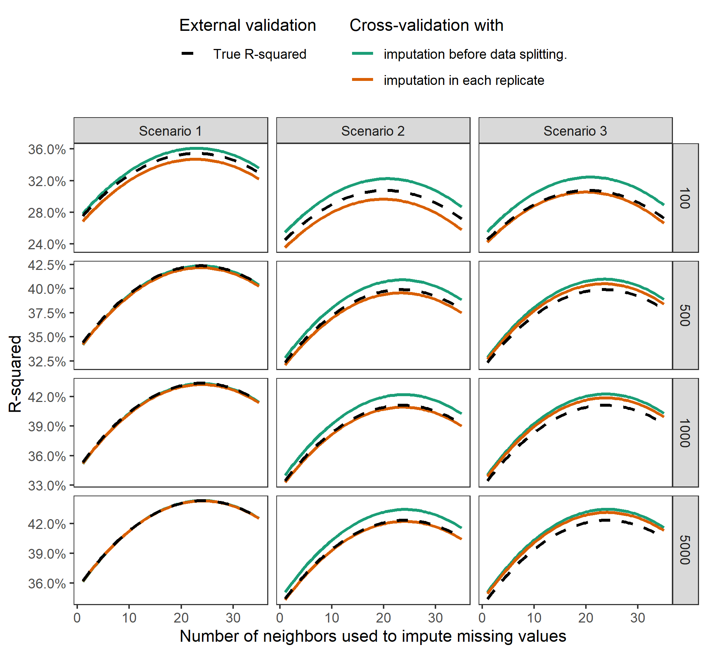

```{r, include = FALSE}

knitr::opts_chunk$set(echo = FALSE, message = FALSE)

# prevent scientific notation from printing 1ex for small / large numbers
options(scipen = 99999)

library(tidyverse)
library(tblStrings)

sim_desc <- read_rds('../results/02-sim_descriptives.rds')
sim_tbls <- read_rds('../results/03-sim_tabulate.rds')


```

\section{Introduction} 

<!-- Welcome! please feel free to make edits and submit pull requests. -->

In evaluating the performance of predictive modeling algorithm, it is understood that so-called training error (the predictive error measured on observations used to fit the model) is a poor proxy for generalization error (the performance of the model on future, as-yet-unseen, observations). The training error of a model will often be overly optimistic for the generalization error. As such, it is standard practice to use sample-splitting methods to estimate generalization error. These methods train and test models using separate datasets. Cross-validation (CV) is a common sample-splitting method that partitions a dataset into $v$ non-overlapping subsets (\ie folds). Each fold is then used as an internal testing set for a modeling algorithm that is developed using data from the $k-1$ remaining folds. Aggregating errors from all $k$ replications of this procedure provides an estimate of the modeling algorithm's generalization error, making $k$-fold CV an ideal technique to 'tune' modeling algorithms (\ie select optimal values for parameters that govern the algorithm's fitting procedure). 


Machine learning analyses often involve 'pipeline' modeling algorithms, which are sequences of operations that may include data pre-processing, predictor variable selection, model fitting, and ensembling.[@mlr3] For example, a pipeline may begin by centering and scaling predictor values, then filter out redundant correlated predictors, and finally fit a regression model to the remaining data. To estimate the generalization error of pipeline modeling algorithms using CV, it is recommended that the entire sequence of steps be carried out during each replicate of CV to mimic the application of the entire pipeline to an external testing set. However, it has been stated that unsupervised variable selection steps (\ie steps that ignore the outcome variable) can be applied before conducting CV without incurring bias.[@hastie2009elements] Since unsupervised predictor variable selection does not involve outcome variables, it does not give the selected predictors an unfair advantage during CV. 

Missing data (MD) occur frequently in machine learning analyses, and several learning algorithms (e.g., regression) are incompatible with MD. Imputation is a technique that replaces MD with estimated values, and is often among the most computationally expensive operations in pipeline modeling algorithms. For example, the \texttt{missForest} imputation algorithm may fit one random forest model for each column that contains MD. Computational expense of applying \texttt{missForest} or other complex imputation strategies during each replicate of CV may lead analysts to prefer more convenient but less effective strategies to handle MD. A more computationally efficient approach would be to implement `unsupervised imputation' (\ie imputing MD without accessing outcome information) \emph{before} conducting CV. However, it is unclear whether an unsupervised operation that modifies the training data (\ie imputation) rather than removing columns from the training data (\ie variable selection) can be applied prior to CV without causing model error estimates to become overly optimistic. 

In this manuscript, we conduct empirical studies assessing whether unsupervised imputation implemented to the training data before CV (a strategy we will refer to as \icv) can yield error estimates for the entire pipeline modeling algorithm that conistently estimate its generalization error. We compare estimated pipeline error according to \icv\space with estimated pipeline error when unsupervised imputation is applied \emph{during each replicate} of CV (a strategy we will refer to as \cvi). Both simulated and real data are leveraged to draw these comparisons, and all scripts used to generate results are publically available on the [first author's GitHub](https://github.com/bcjaeger/Imputation-and-CV). Our analysis also introduces and applies the \texttt{ipa} R package (\textbf{i}mputation for \textbf{p}redictive \textbf{a}nalytics), which provides functions to create single or multiple imputed training and testing sets for prediction modeling. 

The rest of this manuscript is organized as follows. In Section \ref{sec:missing_data}, we discuss MD mechanisms and prevailing MD strategies for statistical inference and machine learning. In Section \ref{sec:oop}, we explicitly map the order of operations for \cvi\space and \icv. In section \ref{sec:sim}, we conduct a simulation study to assess empirical differences between \cvi\space and \icv. The two procedures are compared using real data in Section \ref{sec:app}. Last, in Section \ref{sec:discuss}, we organize the data from preceding sections to form recommendations for practitioners. 

\section{Missing data} \label{sec:missing_data}

<!-- % P1 discuss types of missing data: MCAR / MAR / MNAR -->
<!-- %  1. MCAR (no bias, but efficiency) -->
<!-- %  2. MAR (remove bias by imputing features) -->
<!-- %  3. MNAR (need to go beyond imputation; not touching this) -->

\paragraph{Missing data mechanisms} MD mechanisms were first formalized by Rubin,[@rubin1976inference] who developed a framework to analyze MD that supposes each data point has some probability of being missing. If the probability of missingness is unrelated to the data (\ie all data are equally likely to be missing), then the data are missing completely at random (MCAR). When the probability of missingness is related to observed variables in the data (\ie all data within observed groups are equally likely to be missing), the data are missing at random (MAR). If the probability of missingness is determined by reasons that are unknown or unobserved, the data are missing not at random (MNAR). To illustrate, if a doctor did not run labs for a patient because the clinic was too crowded at the time, the patient's data are MCAR. If instead the doctor chose not to measure the patient's labs because the patient was too young, the patient's data are MAR. If the patient missed the appointment because the patient was too sick, the patient's data are MNAR. In the context of statistical learning, previous findings have shown that when data are MNAR, imputation alone is often less effective than incorporating features that characterize missing patterns (\eg missingness incorporated as an attribute).[@twala2008good; @twala2009empirical; @tang2017random] Since the primary aim of the current study is to assess the differences between two implementations of imputation (\ie \icv\space and \cvi), we focus analyses on cases where data are MAR or MCAR.  

<!-- % P2 workflow for engaging with missing data for inferential analysis -->
<!-- %  1. imputation and multiple imputation for regression -->
<!-- %     - note propensity scores; we aren't touching this -->
<!-- %  2. inference imputation focuses on obtaining valid test statistics -->

\paragraph{Missing data strategies for statistical inference} The primary objective for statistical inference in the presence of MD is to obtain valid test statistics for statistical hypotheses. Imputation to the mean and, more broadly, MD strategies that create a single imputed value, have been shown to increase type I errors for inferential statistics by artificially reducing the variance of observed data and ignoring the uncertainty attributed to MD, respectively. Multiple imputation, a widely recommended strategy to handle MD for statistical inference, is capable of producing valid test statistics when data are MCAR or MAR because it can simultaneously address the two shortcomings listed in the previous sentence. It is notable that the `accuracy' of imputed values is not critical for the success of multiple imputation, given sufficient estimates of conditional distributions [@van2018flexible]. Instead, it is the consistency of the estimated covariance matrix for regression coefficients that makes this strategy ideal for statistical inference. 

<!-- % Byron finish these by next meeting (April 20th) -->

<!-- % P3 predictive modeling -->
<!-- %  1. prediction imputation focuses on prediction accuracy for new data -->
<!-- %    - introduce predictive modeling  -->
<!-- %    - introduce the paradigm of tuning parameters -->
<!-- %    - introduce cross-validation and generalization error -->

\paragraph{Missing data strategies for statistical prediction} The primary objective for statistical prediction in the presence of MD is to develop a prediction function that accurately generalizes to external data that contain missing values. In contrast to statistical inference, single imputation is often used for prediction models. Moreover, imputation strategies with greater accuracy often lead to better performance of downstream models (\ie models fitted to the imputed data). For example, Jerez et al. found that single imputation using machine learning models provided superior downstream model prognostic accuracy compared to multiple imputation based on regression and expectation maximization.[@jerez2010missing] The results of this analysis exemplify a perspective that will be taken throughout the current study. Namely, the authors treated imputation strategies as components of the modeling pipeline, with parameters that can be 'tuned' in the same manner as a prediction model. 


\section{Order of Operations} \label{sec:oop}

<!-- % P4 workflow for engaging with missing data in predictive modeling -->
<!-- %  1. workflow, diagram ** move to order of ops -->
<!-- %  2. other methods, like missingness incorporated as an attribute. -->
<!-- %  footnote. using both MIA and imputation -->
<!-- %  3. imputation for prediction optimizes accuracy of predicted values -->
<!-- %    - fits into the paradigm of tuning parameters -->
<!-- %    - introduce generalization error versus imputation error -->
<!-- %       - normally correlated, but it is problem-dependent (i.e. only one feature matters) -->
<!-- %    - focus on generalization error b/c topic of CV and imputation, and CV is about generalization error. -->

In the context of statistical prediction, analysts usually work with a training set and and an external testing set. A pipeline modeling algorithm developed with data from the training set can be externally validated using data from the testing set. Workflows to develop and validate a pipeline model often include three steps: (1) selection of pipeline parameter values (\ie parameters relevant to any operation in the pipeline), (2) training and application of data pre-processing operations for the training and testing sets, separately, (3) development of a prediction model using data from the training set, and (4) validation of the prediction function using data from the testing set. (\textbf{Figure} \ref{fig:workflow_ml}). Pipeline parameter values may be set apriori or determined empirically using resampling (\eg $k$-fold CV). We refer to the $k-1$ folds and $k$ remaining fold used to internally train and test a modeling algorithm as analysis and assessment sets, respectively, to avoid abuse of notation.


```{r, out.width='100%', fig.cap='A modeling pipeline for machine learning analysis.\\label{fig:workflow_ml}'}


```

<!-- Add diagrams for the CV methods -->

If CV is applied to facilitate selection of pipeline parameter values, it is critical that analysis data are separated from assessment data before any 'learning' is done. The entire \emph{supervised} pipeline must be run using only the assessment data. This applies both to supervised data pre-processing steps (\eg selecting all variables with high correlation to the outcome) as well as supervised modeling procedures (\eg regression). 'Data leakage' can occur when outcome information from the assessment set is leveraged to modify the analysis set, \eg supervised variable selection is performed on a stacked set comprising analysis and assessment data, rather than just the assessment data (CITE). There are a number of examples showing wildly optimistic estimates of generalization error because of data leakage. In scenarios with a larger number of features, even simple methodologies such as selecting those features with high individual correlation to the outcome can induce substantial bias (CITE).

To remove any possibility of data leakage, all steps of the pipeline may be performed in analysis and assessment sets, separately, within each replicate of CV. For example, consider centering and scaling predictor variables such that they have zero mean and unit variance. As these operations do not involve the outcome, they are entirely unsupervised. Nevertheless, centering and scaling operations are usually completed in analysis and assessment sets, separately, during each replicate of CV. Specifically, the means and standard deviations are computed using the analysis data and then those values are applied to center and scale predictors in both the analysis and assessment sets (CITE). We refer to this traditional implementation of CV as \cvi\space (\textbf{Figure} \ref{fig:workflow_cvi}) and refer to our experimental implementation of CV (\ie one where unsupervised imputation occurs before CV begins) as \icv\space (\textbf{Figure} \ref{fig:workflow_icv}). Regardless of which implementation is applied, the output of CV is a set of pipeline parameter values and an estimate of generalization error. The pipeline parameter values are subsequently used to develop and validate a final prediction model using the full training set and testing set, respectively.

```{r, out.width='100%', fig.cap='A traditional workflow for cross-validation that applies k-nearest neighbor unsupervised imputation within each replicate (\\ie \\cvi).\\label{fig:workflow_cvi}'}

knitr::include_graphics('../diagrams/workflow_CVI.png')

```

```{r, out.width='100%', fig.cap='An experimental workflow for cross-validation that applies k-nearest neighbor unsupervised imputation prior to data splitting (\\ie \\icv).\\label{fig:workflow_icv}'}

knitr::include_graphics('../diagrams/workflow_ICV.png')

```


<!-- % P1 talk about the importance of order or operations for supervised learning -->
<!-- %   example - mean/scale in each fold versus before CV -->
<!-- %   example - supervised, variable screening based on Y~X  -->

<!-- % P2 Spell out the two different procedures (two diagrams) -->
<!--     % note at end of day you refit procedure with best parameters on all training data -->

<!-- % P3 contrived supervised imputation example:  -->
<!-- % 100 observations and 100 predictors, each has 50% missing, all noise -->
<!-- % for each x, fit x ~ y, predict missing values using that model -->
<!-- % cv.glmnet(y ~ X) -->

\subsection{Testing data}

Ideally, external testing data will not contain MD, and imputation will not be necessary. However, If MD are present in the external testing data, additional steps may be taken to perform imputation. One may approach the imputation of testing data using (1) only the training data, (2) only the testing data, or (3) using both training and testing data. It is common to use only the training data to impute MD in the testing data. However, some imputation procedures can only impute values in the data that were used to train the imputation procedure (\eg matrix decomposition methods such as \texttt{softImpute}).[@softImpute] To apply these types of imputation procedures, approach (2) or (3) may be taken. Throughout the current study, we use only the training data to impute missing values in the testing data, \cvi\space uses only the analysis data to impute missing values in the assessment data, and \icv\space uses a stacked version of the analysis and assessment data (\ie all of the training data) to impute missing values.

<!-- % P1 for future data that are complete, -->
<!-- % life is good, use predictive model: -->
<!-- % reminder we refit model with CV-optimal parameters to full data. -->
<!-- % if future data that are incomplete, -->
<!-- % imputation step is uncertain:  -->
<!-- %  use only training data (this is what most people do) -->
<!-- %  use only testing data.  -->
<!-- %  use stacked data. (perhaps add details about when this is used) -->
<!-- % we are focusing on the first one b/c it's recommended and frequently used -->

\section{Simulated experiments} \label{sec:sim}

<!-- % P1 intro to simulation -->
<!-- %  point out that theoretical results are difficult to obtain -->
<!-- %  describe the goal - mention that we evaluate model accuracy, not impute accuracy -->
<!-- %  secondary goal is to monitor computation time -->
<!-- %  describe the varying parameters:  -->
<!-- %    ratio of features to obs -->
<!-- %    labeled or un-labeled batches -->
<!-- %    missing pattern -->
<!-- % note the prediction model: glmnet -->
<!-- % note the imputation model: knn  -->
<!-- % NOTE FOR SIMS: update alpha to be 0.90 -->


The goal of the current simulation study was to assess empirical differences between \cvi\space and \icv. Our primary objective was to measure and compare how well each strategy approximated a model's true generalization error. We assessed estimation of true external $R^2$ using bias, variance, and root-mean-squared error (RMSE). The RMSE provides an overall assessment of estimation accuracy that depends on both bias and variance. A secondary objective was to assess the performance of downstream modeling strategies whose tuning parameters were selected using \cvi\space and \icv.

\subsection{Data-generating mechanisms} \label{subsec:data_gen}

 <!-- P2 describe data generation and three simulation scenarios -->
 <!-- - all effects were linear, no interactions -->
 <!--   however, X was generated differently in each scenario.  -->
 <!-- Note that X is generated with autoregressive correlation structure -->
 <!-- and that in batch cases, X means are generated randomly for each group. -->
 <!-- 1. iid situation that most predictive modeling analyses assume -->
 <!--  the same data-generating mechanism in train/test sets -->
 <!-- 2. batch setting: groups are observed and cross-validation is performed using leave one group out. Example: combining data from multiple studies -->
 <!-- make sure to describe how we generate batches  -->
 <!-- 3. batch setting with unobserved groups. -->


Consider the linear regression model, where a continuous outcome vector $\textbf{y} = \lbrace y_1, y_2, \ldots, y_N\rbrace$ is generated by a linear combination of predictor variables $\textbf{X} = \left[ \textbf{x}_1, \textbf{x}_2, \ldots \textbf{x}_p \right]$. This functional relationship is often expressed as $$\textbf{Y} = \textbf{X} \beta + \varepsilon,$$ where $\beta$ is a $p \times 1$ vector of regression coefficients and $\varepsilon$ is a normally distributed $N \times 1$ zero-mean random error vector. In practice, $\textbf{X}$ often has some 'junk' variables that are not related to the outcome. We fixed the number of true predictor variables at 10,  the standard error of $\varepsilon$ at 1, and set $\beta = [`r format(round(seq(-1, 1, length.out = 10),2), nsmall=2)`]$ throughout the simulation study. Columns of $\textbf{X}$ were generated from a multivariate normal distribution with a first order autoregressive correlation structure. Specifically, the correlation between columns $\textbf{x}_i$ and $\textbf{x}_j$ was $\rho^{\left| i-j \right|}$, where $\rho$ was set to 3/4 throughout the study. We applied this design to generate a training set of varying size (100, 500, 1000, or 5000) along with an external validation set comprising `r format(sim_desc$validation_size, big.mark =',')` observations in each simulated replicate. 

We created three data-generation 'scenarios'. In scenario 1, the observed data are independent and identically distributed (iid). In scenario 2, the data are iid conditional on an observed grouping variable. A total of 11 groups are formed, one in the validation set and the remaining 10 in the training set. Each group is characterized by a randomly generated mean value for its predictor variables. During CV, the observed groups are separated into ten folds to mimic the prediction of outcomes in a population with different characteristics. Scenario 3 is identical to scenario 2 except that the grouping variable is latent. Consequently, CV does not break the observed groups into separate folds for scenario 3. 

 <!-- P3 how we generated missingness -->
 <!-- - missingness was either mcar / mar, ampute function in mice -->
 <!-- - briefly describe ampute function -->
 <!--   - note that missingness was done by case (90%) -->
 <!--   - this translates to about 40% missing data overall -->

\paragraph{Amputing data} We applied the \texttt{ampute} function from the \texttt{mice} R package to generate missing values in simulated data. In each replicate, 90% of observations comprised at least one missing value. We designated up to $p$ MD patterns randomly in each simulation replicate, where $p$ is the number of non-outcome columns in the simulated data. A MD pattern indicates which of the $p$ predictor variables are set to missing. For each MD pattern, the number of missing variables was randomly set to an integer ranging from 1 to $p/2$. This procedure usually induced missing values in 30-50\% of the data. When data were MAR, we applied the default method for the \texttt{ampute} function (\texttt{ampute.default.weights}) to induce missingness based on the observed variables. Throughout the experiment, we applied the same missing patterns and MD mechanism in the training set and the external validation set.

\paragraph{Modeling procedure} We applied $k$-nearest-neighbor imputation to handle MD and least absolute shrinkage and selection operator (LASSO) regression to develop prediction functions throughout the simulated experiments. Nearest neighbors in the training set were used to form imputed values in the training and external validation sets. We created one imputed set for each $k \in \lbrace 1, 2, \ldots, 35\rbrace$. We selected a value for the regularization parameter $lambda$ in each imputed dataset, separately, using 10-fold CV (\ie \texttt{cv.glmnet}). The $\lambda$ value selected was the one that minimized cross-validated RMSE. 


<!-- P4 TABLE RECIPES
 1 table for each of these 
 predictive accuracy by R2 b/c we want a scale-invariant quantity
 Raw bias of predictive accuracy (as R^2)
 Standard deviation of predictive accuracy (as R^2)	
 rMSE of predictive accuracy (as R^2)  
 P5 results (pulling some facts from tables) 
-->

\paragraph{Analysis plan}

We varied the scenario (1, 2, or 3; described in a preceding paragraph), missing mechanism (MCAR or MAR), ratio of predictor variables to junk variables (1:1, 1:4, and 1:49), and the number of training observations ($N$ = 100, 500, 1,000, 5,000). We present results for each of `r sim_desc$total_scenarios` settings determined by these parameters and also provide overall summary statistics for scenarios 1, 2, and 3 when data are MCAR and MAR (\ie aggregating over training sample size and predictor to noise ratio). In each simulation replication, we computed the true external $R^2$ in the validation set for each potential value of nearest neighbors (\ie $k \in \lbrace 1, 2, \ldots, 35 \rbrace$). We also estimated external $R^2$ for each value of $k$ using \cvi\space and \icv, separately, to evaluate how well these CV procedures estimated the true external $R^2$. We assessed the difference between estimated external $R^2$ according to \cvi\space and \icv\space as well as the bias, variance, and root-mean-squared error (RMSE) of these estimates.  Last, we investigated the accuracy of downstream models when \cvi\space and \icv\space were applied to select the number of neighbors to use for imputation and the regularization parameter for a penalized regression model.

 
\subsection{Results} \label{subsec:sim_results}

```{r, include = FALSE}


r2_ext_range <- sim_tbls$data_mse %>%
  summarize(min = min(external_mn), max = max(external_mn)) %>% 
  mutate_all(~format(round(.x, 3), digits = 3))

r2_ext_min <- pull(r2_ext_range, min)
r2_ext_max <- pull(r2_ext_range, max)

r2_ext_diff23 <- sim_tbls$data_mse %>%
  separate(key, into = c('scenario', 'miss_mech'), sep = '_') %>% 
  select(scenario, miss_mech, nobs, ncov, external_mn) %>% 
  pivot_wider(values_from = external_mn, names_from = scenario) %>% 
  summarise(value = max(abs(s2 - s3))) %>% 
  mutate(value = format(round(value, 3), digits = 3)) %>% 
  pull(value)

# rbs and std values were multiplied by 100 in an earlier analysis
# this was done to make their tables look less tedious. 
# To present results in the main text, I am dividing rbs and std
# values by 100.  I do not think this will confuse reviewers b/c
# the tables clearly point out that the values are scaled by 100,
# whereas the text does not make any statement about scaling.
# But maybe it will still confuse reviewers? Suggestions are welcome.


puller <- function(data, .scenario, .miss_mech, .type){
  filter(data, scenario == .scenario, miss_mech == .miss_mech) %>% 
  select_at(vars(starts_with(.type))) %>% 
  as.numeric() %>% 
  round(5) %>% 
  format(nsmall = 5)
}

pull_icv <- function(data, scenario, miss_mech){
  puller(data, scenario, miss_mech, 'imp_cv')
}

pull_cvi <- function(data, scenario, miss_mech){
  puller(data, scenario, miss_mech, 'cv_imp')
}
  
rbs_smry <- sim_tbls$data_mse %>%
  filter(ncov == 'Overall') %>% 
  select(key, ends_with('rbs')) %>% 
  mutate_at(vars(ends_with('rbs')), ~.x/100) %>% 
  separate(key, into = c('scenario', 'miss_mech')) 

std_smry <- sim_tbls$data_mse %>%
  filter(ncov == 'Overall') %>% 
  select(key, ends_with('std')) %>% 
  mutate_at(vars(ends_with('std')), ~.x/100) %>% 
  separate(key, into = c('scenario', 'miss_mech')) 

rmse_smry <- sim_tbls$data_mse %>%
  filter(ncov == 'Overall') %>% 
  select(key, ends_with('rmse')) %>% 
  mutate_at(vars(ends_with('rmse')), ~.x/100) %>% 
  separate(key, into = c('scenario', 'miss_mech')) 

tune_smry <- sim_tbls$data_tune %>%
  filter(ncov == 'Overall') %>% 
  select(key, ends_with('r2')) %>% 
  mutate_at(vars(ends_with('r2')), ~.x/100) %>% 
  separate(key, into = c('scenario', 'miss_mech')) %>% 
  mutate(diff = abs(imp_cv_r2 - cv_imp_r2))

tune_biggest_diff <- tune_smry %>% 
  arrange(desc(diff)) %>% 
  slice(1) %>% 
  select(scenario, miss_mech, diff, imp_cv_r2) %>% 
  mutate(scenario = recode(scenario, 's1' = 'scenario 1', 
    's2' = 'scenario 2', 's3' = 'scenario 3'),
    perc_diff = format(round(100 * diff / imp_cv_r2, 2), nsmall = 2))

tune_smallest_diff <- tune_smry %>% 
  arrange(desc(diff)) %>% 
  slice(n()) %>% 
  select(scenario, miss_mech, diff) %>% 
  mutate(scenario = recode(scenario, 's1' = 'scenario 1', 
    's2' = 'scenario 2', 's3' = 'scenario 3'))

cvi_wins <- tune_smry %>% 
  summarize(cvi_wins = sum(cv_imp_r2 > imp_cv_r2)) %>% 
  as.numeric()

```

Overall, a total of `r sim_desc$observed` out of `r sim_desc$expected` (`r sim_desc$converged`) simulation replicates were completed over a span of `r format(round(sim_desc$total_hours, 0), big.mark = ',')` computing hours. Incomplete replicates were not analyzed, as these were replicates where at least one of the amputation, imputation, or prediction models did not converge. Across all replicates, the mean number of minutes used to form imputed data using \cvi\space and \icv\space were `r paste(sim_desc$time_compare$time_minutes, collapse = ' and ')`, respectively, a ratio of `r round(sim_desc$time_compare$time_ratio[1], 2)`. As a point of reference, using the full training set, the mean number of minutes needed to tune and fit \texttt{glmnet} models was `r sim_desc$time_mdl_fit`. 


Across all scenarios, the mean external $R^2$ ranged from `r r2_ext_min` to `r r2_ext_max` (\textbf{Table} \ref{tab:ext_rsq}). External $R^2$ values were positively correlated with training set size and the ratio of predictor variables to junk variables. Notably, the mean external $R^2$ values in scenario 1 were uniformly greater than corresponding mean external $R^2$ values in scenarios 2 and 3, and the maximum difference between mean external $R^2$ values in scenario 2 versus scenario 3 was `r r2_ext_diff23`. The mean absolute difference between external $R^2$ estimates using \cvi\space and \icv\space shrunk towards zero as the size of the training set increased (\textbf{Table} \ref{tab:cv_diffs}). The differences between \cvi\space and \icv\space were lowest in scenario 1 and greatest in scenario 2. These patterns were also present in visual depictions of external $R^2$ portrayed as a function of $k$ neighbors (\textbf{Figure} \ref{fig:sim_r2}). 

\paragraph{Bias, variance, and RMSE}

For scenario 1, the overall bias of $R^2$ estimates under MCAR using \cvi\space was `r pull_icv(rbs_smry, 's1', 'mcar')` versus `r pull_cvi(rbs_smry, 's1', 'mcar')` using \icv\space (\textbf{Table} \ref{tab:bias}). When the data were MAR, the overall biases were `r pull_cvi(rbs_smry, 's1', 'mar')` for \cvi\space versus `r pull_icv(rbs_smry, 's1', 'mar')` for \icv\space.  In scenarios 2 and 3, the bias of \cvi\space was lower than that of \icv\space, and \icv\space consistently provided overly optimistics error estimates. The overall standard deviation of $R^2$ estimates was higher for \cvi\space versus \icv\space in all three scenarios and both missing data mechanisms. The difference in standard deviation was most pronounced in scenario 3 when data were MCAR (`r pull_cvi(std_smry, 's3', 'mcar')` [\cvi] versus `r pull_icv(std_smry, 's3', 'mcar')` [\icv]; \textbf{Table} \ref{tab:variance}). Despite the optimistic bias of \icv\space in scenario 2, the reduced variance of this approach lead to a lower overall RMSE for external $R^2$ compared to \cvi\space (\textbf{Table} \ref{tab:rmse}). When the data were MCAR in scenario 2, \cvi\space and \icv\space obtained RMSEs of `r pull_cvi(rmse_smry, 's2', 'mcar')` and `r pull_icv(rmse_smry, 's2', 'mcar')`, respectively. Similarly, when the data were MAR in scenario 2, overall RMSE values were `r pull_cvi(rmse_smry, 's2', 'mar')` and `r pull_icv(rmse_smry, 's2', 'mar')`. 

\paragraph{Downstream model performance}

When \cvi\space and \icv\space were applied to select tuning parameters, the overall mean external $R^2$ was higher using \cvi\space in `r cvi_wins` out of `r nrow(tune_smry)` comparisons (\textbf{Table} \ref{tab:tune}). The greatest overall difference in mean $R^2$ between downstream models occurred in `r tune_biggest_diff$scenario` when the data were `r toupper(tune_biggest_diff$miss_mech)` (absolute difference in model $R^2$: `r format(round(tune_biggest_diff$diff, 5), nsmall = 5)`; relative difference in model $R^2$ : `r tune_biggest_diff$perc_diff`%). 

\section{Real data experiments} \label{sec:app}

The goal of the current resampling study was to repeat the comparisons that were summarized in Section \ref{sec:sim} between \cvi\space and \icv\space using real, publically accessible data. A secondary objective was to assess how much results would change if different modeling strategies were applied. 

\paragraph{Ames, Iowa housing data}

The data we use in this resampling study describe the sale of individual residential property in Ames, Iowa from 2006 to 2010. The entire set contains 2930 observations and 80 variables (23 nominal, 23 ordinal, 14 discrete, and 20 continuous) that can be leveraged to predict the sale price of homes.\cite{de2011ames} We used a cleaned version of the Ames data for our own analyses by applying the \texttt{make\_ames()} function, available in the \texttt{AmesHousing} R package.\cite{AmesHousing} We also log-transformed the skewed sale price outcome.

\paragraph{Analysis plan}

We conducted a resampling study where the Ames housing data was randomly split into training ($N = 2198$, 75%) and testing ($N = 732$, 25%) sets in each of 5,000 iterations. In each resampling replicate, we implemented two separate modeling strategies to develop prediction functions using the training set: (1) unpenalized linear regression and (2) random forests. We also implemented two imputation strategies: (1) nearest neighbor imputation using 1, 2, \ldots, 35 neighbors and (2) mean and mode imputation for numeric and nominal variables, respectively. In addition to imputation, data were pre-processed by lumping values in discrete variables into an 'other' category if the value accounted for less than 10% of the observed values. Both CV techniques (\ie \cvi\space and \icv) were implemented to estimate the external generalization error of the linear regression and random forest models when nearest neighbor imputation was applied.

\paragraph{Amputing data}

The training and testing data were amputed in the same manner using four prototypes of missingness. The prototypes were characterized by having missing values for all variables describing the house (1) lot and garage, (2) longitude and latitude, (3) basement and year built, and (4) overall quality and general above ground square footage. We restricted our prediction models to consider only the 30 predictor variables belonging to at least one of these missing prototypes.

\subsection{Results}

```{r}
ames <- read_rds("../results/07-ames_tabulate.rds")

ames_bias <- ames$tbl_data %>% 
  filter(measure == 'Bias')

ames_sd <- ames$tbl_data %>% 
  filter(measure == 'Standard deviation')

```


A total of `r ames$nsims` out of `r ames$nsims` (100%) resampling replicates were completed over a span of `r tbl_val(ames$times)` computing hours. Across all replicates, the mean number of minutes used to form imputed data using \cvi\space and \icv\space were `r tbl_val(ames$times_cvi)` and `r tbl_val(ames$times_icv)`, respectively. The mean (standard deviation) external $R^2$ for the linear regression and random forest models were `r glue::glue_collapse(na.omit(ames$tbl_data$ext), sep = ' and ')`, respectively. Overall, both CV techniques slightly over and under estimated the external $R^2$ value when linear regression and random forests were applied, respectively. For linear regression, the mean (standard deviation) bias was `r ames_bias$cvi[1]` and `r ames_bias$icv[1]` for \cvi\space and \icv, respectively. The standard deviation of error estimates were `r ames_sd$cvi[1]` and `r ames_sd$icv[1]`, respectively. For random forests, the mean (standard deviation) bias was `r ames_bias$cvi[2]` and `r ames_bias$icv[2]` for \cvi\space and \icv, respectively. The standard deviation of error estimates were `r ames_sd$cvi[2]` and `r ames_sd$icv[2]`, respectively.

When \cvi\space and \icv\space were applied to select the number of neighbors used for imputation, downstream linear models obtained an external $R^2$ of `r ames$tuned_smry$cvi_lm` and `r ames$tuned_smry$icv_lm`, respectively. Similarly, downstream random forests obtained an external $R^2$ of `r ames$tuned_smry$cvi_rf` and `r ames$tuned_smry$icv_rf`, respectively. As a reference point, the mean (standard deviation) downstream external $R^2$ was `r ames$meanimpute_smry$ext_lm` and `r ames$meanimpute_smry$ext_rf` using linear regression and random forests, respectively. 

\section{Discussion and recommendations} \label{sec:discuss}

We demonstrated empirical properties of \cvi\space and \icv\space using nearest-neighbor imputation prior to applying regression and random forest models. We selected these methods because they have been studied thoroughly and are widely used in applied settings. In simulated experiments, we generated outcomes using linear effects without interaction. We also studied three broad scenarios that were relevant to CV: Scenario 1 was an ideal setting where \icv\space and \cvi\space should have provided almost identical estimates of generalization error. Scenarios 2 and 3 were meant to test whether \icv\space produced biased estimates of generalization error because in settings where \icv\space clearly did not mimic the final application of a trained model to an external validation set. Remarkably, despite its bias in scenario 2, the reduction in variance of $R^2$ estimates using \icv\space lead to a lower overall RMSE compared to \cvi. Downstream model performance was consistently superior when \cvi\space was used instead of \icv. However, the increase in performance was smaller than 1% relative change (maximum overall relative difference in external $R^2$: `r tune_biggest_diff$perc_diff`%). While this difference is very small, it may be possible to find a different generative scenario where the difference is larger.

<!-- % P1 summary -->

<!-- % P2 cautions about supervised imputation for prediction modeling: -->
<!-- %  1. imputation for inference/prediction are different -->
<!-- %  Refer back to Order of operations example -->

Unsupervised imputation has two interesting characteristics relevant to predictive modeling. First, it allows for imputation of testing data whose outcome data are unobserved (not missing), \eg predicting risk for incident cardiovascular disease among adults with no history of cardiovascular disease. Second, as the current analysis has shown, unsupervised imputation can be applied before CV in select settings without inducing overly optimistic estimates of model error. The benefits of this approach include (1) reduced computational overhead, (2) reduced variance in model error estimates, and (3) little difference in the performance of downstream models. If investigators are confident that training and testing data are identically distributed or are primarily concerned with selecting optimal tuning parameters, \icv\space may be an extremely convenient workflow to implement. However, the drawbacks of \icv\space include increased bias for model estimation, particularly in settings similar to scenario 2 (described in Section \ref{subsec:data_gen}). If investigators are primarily interested in estimating model error without bias and cannot rule out the possibility that testing data are drawn from a different population or distribution than their training data, the current study clearly suggests \cvi\space should be applied instead of \icv.


The current study has several strengths. We implemented computational experiments using real and simulated data. We included different data-generation mechanisms, different modeling procedures, different MD patterns, and different modeling strategies to ensure our results generalized to several common analytical settings. We examined a wide variety of metrics to assess the benefits and weaknesses of applying \icv\space versus \cvi. Last, we have provided (1) an R package that conducts unsupervised imputation and (2) a github repository disseminating all of the code necessary to reproduce our results. Each of these supplemental components ensure that our work is easily reproduced and disseminated. There are also some gaps in the current study that can be filled by future work. We investigated $v$-fold CV in the current analysis. Future research may assess whether these results generalize to other forms of data-splitting such as Monte-Carlo CV or bootstrap CV. Because MNAR data present challenges that may not be overcome by imputation alone, we did not include simulations for MNAR data. Whether the current study's findings generalize to settings with MNAR data remains an interesting, unanswered question. Last, the current study has applied k-nearest neighbor imputation throughout. As many other types of imputation procedures have been established, there are numerous extensions of the current analysis that may explore whether our results hold when other imputation approaches are implemented.

<!-- % P.. R package -->

\FloatBarrier


`r sim_tbls$tbl_ext_rsq`

`r sim_tbls$tbl_cv_diffs`

`r sim_tbls$tbl_bias`

`r sim_tbls$tbl_var`

`r sim_tbls$tbl_rmse`

`r sim_tbls$tbl_tune`

```{r, out.width='100%', fig.cap='External generalization error and internal estimates of generalization error using \\icv\\space and \\cvi \\label{fig:sim_r2}'}



```

\FloatBarrier
