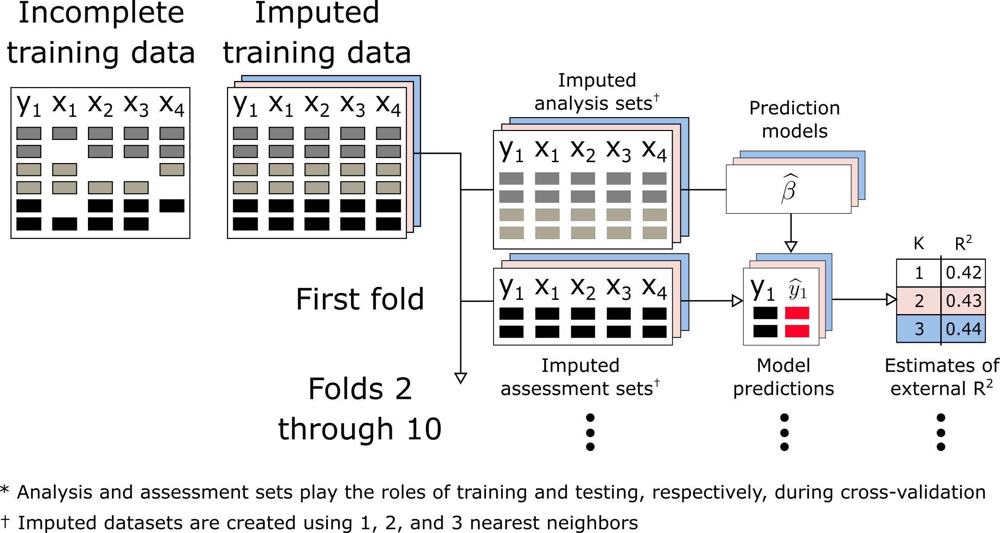

```{r, include = FALSE}

knitr::opts_chunk$set(echo = FALSE, message = FALSE)

# prevent scientific notation from printing 1ex for small / large numbers
options(scipen = 99999)

library(tidyverse)

sim_desc <- read_rds('../results/02-sim_descriptives.rds')
sim_tbls <- read_rds('../results/03-sim_tabulate.rds')


```

# Introduction

<!-- Welcome! please feel free to make edits and submit pull requests. -->

In evaluating the performance of predictive modeling procedures, it is understood that so-called training error (the predictive error measured on observations used to fit the model) is a poor proxy for generalization error (the performance of the model on future, as-yet-unseen, observations). The training error of a model will often be overly optimistic for the generalization error. For more complex modeling procedures (or on high dimensional data) this over-optimism can be substantial. As such, it is standard practice to use sample-splitting methods to estimate generalization error. These methods train and evaluate models using separate datasets. Cross-validation (CV) is a common sample-splitting technique that partitions a dataset into $v$ folds. In each replicate of CV, a single fold is designated as validation data and the remaining $v-1$ folds are combined to form a training dataset. After each fold has been used as validation data, results from the $v$ replicates are aggregated to estimate the modeling procedure's generalization error.

Modeling procedures often involve multiple steps. For example, data pre-processing steps such as centering and scaling predictor values or filtering out redundant correlated predictor variables may occur before model fitting. To estimate the generalization error of multi-step modeling procedures, it is recommended that the entire sequence of steps be carried out during each replicate of CV to mimic the application of the entire procedure to an independent test set. This is particularly important for supervised steps (\ie steps that use the outcome variable). It has been stated that unsupervised steps (\ie steps that ignore the outcome variable) can be done before conducting CV with only minimal bias. However, there are few data quantifying the additional bias incurred by this order of operations. 

Missing data (MD) occur frequently in applied settings, and several machine learning algorithms (e.g., regression) are incompatible with MD. Imputation is a technique that replaces MD with estimated values. Imputation of MD is often one of the most computationally expensive steps in modeling procedures. For example, the \texttt{missForest} imputation algorithm may fit one random forest model for each column that contains MD. Computational expense of applying \texttt{missForest} or other imputation strategies with similar complexity during each replicate of CV scales poorly to larger datasets and to higher numbers of replications. High computational cost may lead analysts to prefer more convenient but less effective strategies to handle MD. A more computationally efficient approach would be to implement `unsupervised imputation' (\ie imputing MD without accessing outcome information) \emph{before} conducting CV. However, there is a lack of evidence substantiating the claim that unsupervised imputation conducted before CV will provide reliable estimates of a multi-step modeling procedure's generalization error. More importantly, there is a lack of evidence outlining scenarios when unsupervised imputation before CV can lead to biased estimates of model error. 

In this manuscript, we identify scenarios when reliable model error estimates can (or cannot) be computed using unsupervised imputation \emph{before} CV (a strategy we will refer to as \icv). We compare estimated model error according to \icv\space with estimated model error when imputation is applied \emph{during each replicate} of CV (a strategy hereafter referred to as \cvi). To objectively compare the accuracy of model error estimates using \icv\space and \cvi, we compute `true' model error using an external validation set with MD. Both simulated and real data are leveraged to draw these comparisons. Our analysis also introduces and applies the \texttt{ipa} R package (\textbf{i}mputation for \textbf{p}redictive \textbf{a}nalytics), which provides functions to create single or multiple imputed training and testing sets for prediction modeling. 

The rest of this manuscript is organized as follows. In Section \ref{sec:app}, we summarize results from experiments using real data from public repositories. Results are summarized alongside our recommendations for applied practice in Section \ref{sec:discuss}

\section{Missing data and cross-validation} \label{sec:mdcv}

<!-- % P1 discuss types of missing data: MCAR / MAR / MNAR -->
<!-- %  1. MCAR (no bias, but efficiency) -->
<!-- %  2. MAR (remove bias by imputing features) -->
<!-- %  3. MNAR (need to go beyond imputation; not touching this) -->

MD mechanisms were first formalized by Rubin, who developed a framework to analyze MD that supposes each data point has some probability of being missing. If the probability of missingness is unrelated to the data (\ie all data are equally likely to be missing), then the data are missing completely at random (MCAR). When the probability of missingness is related to observed variables in the data (\ie all data within observed groups are equally likely to be missing), the data are missing at random (MAR). If the probability of missingness is determined by reasons that are unknown or unobserved, the data are missing not at random (MNAR). To illustrate, if a doctor did not run labs for a patient because the clinic was too crowded at the time, the patient's data are MCAR. If instead the doctor chose not to measure the patient's labs because the patient was too young, the patient's data are MAR. If the patient missed the appointment because the patient was too sick, the patient's data are MNAR. In the context of statistical learning, previous findings have shown that when data are MNAR, imputation alone is often less efficient than incorporating features that characterize missing patterns (\eg missingness incorporated as an attribute)[@twala2008good; @twala2009empirical; @tang2017random]. Since the primary aim of the current study is to assess the differences between two implementations of imputation (\ie \icv\space and \cvi), we focus analyses on cases where data are MAR or MCAR.  

<!-- % P2 workflow for engaging with missing data for inferential analysis -->
<!-- %  1. imputation and multiple imputation for regression -->
<!-- %     - note propensity scores; we aren't touching this -->
<!-- %  2. inference imputation focuses on obtaining valid test statistics -->

The mechanisms of MD and methods to engage with MD have been studied thoroughly in the context of statistical inference. The primary focus in this setting is to obtain valid test statistics for statistical hypotheses in the presence of MD. Imputation to the mean and, more broadly, MD strategies that create a single imputed value, have been shown to increase type I errors for inferential statistics by artificially reducing the variance of observed data and ignoring the uncertainty attributed to MD, respectively. Multiple imputation, a widely recommended strategy to handle MD for statistical inference, is capable of producing valid test statistics when data are MCAR or MAR because it can simultaneously address the two shortcomings listed in the previous sentence. It is notable that the `accuracy' of imputed values is not critical for the success of multiple imputation, given sufficient estimates of conditional distributions [@van2018flexible]. Instead, it is the consistency of the estimated covariance matrix for regression coefficients that makes this strategy ideal for statistical inference. 

<!-- % Byron finish these by next meeting (April 20th) -->

<!-- % P3 predictive modeling -->
<!-- %  1. prediction imputation focuses on prediction accuracy for new data -->
<!-- %    - introduce predictive modeling  -->
<!-- %    - introduce the paradigm of tuning parameters -->
<!-- %    - introduce cross-validation and generalization error -->

In the context of supervised statistical learning, data often include a training set and an external validation set. commonly ordered steps for model development are (1) data pre-processing, (2) tuning model hyper-parameters, (3) training the model(s) on the full training set, and (4) validating the model(s) using the validation set. Handling MD is a pre-processing task conducted in the training and validation sets, separately. In contrast to statistical inference, single imputation is often used in supervised learning workflows and strategies with greater imputation 'accuracy' are preferred. When $k$-fold CV is applied, the training data are split into $k$ non-overlapping subsets (\ie folds). Each fold is then used as a testing set for the model(s) developed on the $k-1$ other folds. Aggregating model errors over all $k$ steps provides an estimate of the modeling procedure's generalization error, making $k$-fold CV an ideal resampling technique for tuning model hyper-parameters or comparing different modeling procedures. To mimic the application of the entire modeling procedure to an independent validation set, it is recommended that all data pre-processing steps be executed in each replicate of CV. Following CV, the generalization error of the modeling procedure(s) is measured by applying the 'tuned' modeling procedure to the entire training set and then evaluating the resulting prediction function's accuracy in the external validation set. 

<!-- % additional text that I left of the previous paragraph: Although multiple imputation has been shown to increase the prediction accuracy of downstream models, the computational overhead of multiple imputation is not ideal. It is generally assumed that the accuracy of downstream models trained on the imputed data will be increased by making the imputed data more closely resemble the unobserved complete data.  -->

<!-- <we focus on generalization error> -->

<!-- <this involves estimating error and picking good tuning parameters> -->

<!-- <this contrasts with imputation accuracy; presumably correlated> -->

There are at least two ways to evaluate the effectiveness of an imputation strategy. One approach is to evaluate how accurately the strategy imputes unobserved data. However, imputation accuracy can only be measured when the values of unobserved data are known, which limits its practical use. Another approach is to evaluate the generalization error of models fitted to the imputed data. This approach is applicable in any setting involving supervised learning. Evaluating imputation strategies in this manner also allows imputation parameters to be 'tuned' in the same manner as parameters in the prediction model. The current manuscript focusses exclusively on generalization error. <something about picking the right tuning parameters, and something else about estimating the error with as little bias as possible>


```{r, out.width='100%', fig.cap='A standard workflow for machine learning analysis.\\label{fig:workflow_ml}'}

knitr::include_graphics('../diagrams/workflow_ML.png')

```

<!-- % P4 workflow for engaging with missing data in predictive modeling -->
<!-- %  1. workflow, diagram ** move to order of ops -->
<!-- %  2. other methods, like missingness incorporated as an attribute. -->
<!-- %  footnote. using both MIA and imputation -->
<!-- %  3. imputation for prediction optimizes accuracy of predicted values -->
<!-- %    - fits into the paradigm of tuning parameters -->
<!-- %    - introduce generalization error versus imputation error -->
<!-- %       - normally correlated, but it is problem-dependent (i.e. only one feature matters) -->
<!-- %    - focus on generalization error b/c topic of CV and imputation, and CV is about generalization error. -->

\section{Order of Operations} 

<!-- Noah work on this! -->

<!-- Add diagrams for the CV methods -->

When employing supervised learning methods with split-sample-validation or cross-validation, it is critical that training data is separated from validation data before any "learning" is done: \emph{The entire supervised pipeline must be run using only training data}. This applies both to the fitting procedure (eg. applying linear regression, or random forests, etc...), and to any supervised preprocessing steps. There are a number of examples in the literature where wildly optimistic estimates of validation error have been obtained because supervised variable selection was performed on the entire dataset, rather than just the training sample (CITE). In scenarios with a larger number of features, even simple methodologies, eg. selecting those features with high individual correlation with outcome, can induce substantial bias (CITE).

It is not unusual to separate training and validation data before performing even unsupervised preprocessing steps. For example, in many supervised learning frameworks, it is common to center and scale features, such that they are mean $0$, variance $1$ before engaging with the outcome. As this does not involve the outcome, it is entirely unsupervised. Nonetheless to most accurately replicate the "fitting process" in each replicate of CV, it is common to learn the centering and scaling parameters for each feature in each training subset, and apply those parameters to center/scale features in the corresponding validation subset (CITE).

```{r, out.width='100%', fig.cap='A traditional workflow for cross-validation that applies imputation within each replicate (\\ie \\cvi).\\label{fig:workflow_cvi}'}

knitr::include_graphics('../diagrams/workflow_CVI.png')

```

```{r, out.width='100%', fig.cap='An experimental workflow for cross-validation that applies unsupervised imputation prior to data splitting (\\ie \\icv).\\label{fig:workflow_icv}'}



```


<!-- % P1 talk about the importance of order or operations for supervised learning -->
<!-- %   example - mean/scale in each fold versus before CV -->
<!-- %   example - supervised, variable screening based on Y~X  -->

<!-- % P2 Spell out the two different procedures (two diagrams) -->
<!--     % note at end of day you refit procedure with best parameters on all training data -->

<!-- % P3 contrived supervised imputation example:  -->
<!-- % 100 observations and 100 predictors, each has 50% missing, all noise -->
<!-- % for each x, fit x ~ y, predict missing values using that model -->
<!-- % cv.glmnet(y ~ X) -->

\subsection{Testing data}

<!-- % P1 for future data that are complete, -->
<!--     % life is good, use predictive model: -->
<!--     % reminder we refit model with CV-optimal parameters to full data. -->

<!-- % P2 for future data that are incomplete, -->
<!-- % imputation step is uncertain:  -->
<!-- %  use only training data (this is what most people do) -->
<!-- %  use only testing data.  -->
<!-- %  use stacked data. (perhaps add details about when this is used) -->
<!-- % we are focusing on the first one b/c it's recommended and frequently used -->

\section{Simulated experiments} \label{sec:sim}

<!-- % P1 intro to simulation -->
<!-- %  point out that theoretical results are difficult to obtain -->
<!-- %  describe the goal - mention that we evaluate model accuracy, not impute accuracy -->
<!-- %  secondary goal is to monitor computation time -->
<!-- %  describe the varying parameters:  -->
<!-- %    ratio of features to obs -->
<!-- %    labeled or un-labeled batches -->
<!-- %    missing pattern -->
<!-- % note the prediction model: glmnet -->
<!-- % note the imputation model: knn  -->
<!-- % NOTE FOR SIMS: update alpha to be 0.90 -->


The goal of the current simulation study was to assess empirical differences between \cvi\space and \icv. Our primary objective was to measure and compare how well each strategy approximated a model's true generalization error. We assessed estimation of true external $R^2$ using bias, variance, and root-mean-squared error (RMSE). The RMSE provides an overall assessment of estimation accuracy that depends on both bias and variance. A secondary objective was to assess the performance of downstream modeling strategies whose tuning parameters were selected using \cvi\space and \icv.

\subsection{Data-generating mechanisms} \label{subsec:data_gen}

 <!-- P2 describe data generation and three simulation scenarios -->
 <!-- - all effects were linear, no interactions -->
 <!--   however, X was generated differently in each scenario.  -->
 <!-- Note that X is generated with autoregressive correlation structure -->
 <!-- and that in batch cases, X means are generated randomly for each group. -->
 <!-- 1. iid situation that most predictive modeling analyses assume -->
 <!--  the same data-generating mechanism in train/test sets -->
 <!-- 2. batch setting: groups are observed and cross-validation is performed using leave one group out. Example: combining data from multiple studies -->
 <!-- make sure to describe how we generate batches  -->
 <!-- 3. batch setting with unobserved groups. -->


Consider the linear regression model, where a continuous outcome vector $\textbf{y} = \lbrace y_1, y_2, \ldots, y_N\rbrace$ is generated by a linear combination of predictor variables $\textbf{X} = \left[ \textbf{x}_1, \textbf{x}_2, \ldots \textbf{x}_p \right]$. This functional relationship is often expressed as $$\textbf{Y} = \textbf{X} \beta + \varepsilon,$$ where $\beta$ is a $p \times 1$ vector of regression coefficients and $\varepsilon$ is a normally distributed $N \times 1$ zero-mean random error vector. In practice, $\textbf{X}$ often has some 'junk' variables that are not related to the outcome. We fixed the number of true predictor variables at 10,  the standard error of $\varepsilon$ at 1, and set $\beta = [`r format(round(seq(-1, 1, length.out = 10),2), nsmall=2)`]$ throughout the simulation study. Columns of $\textbf{X}$ were generated from a multivariate normal distribution with a first order autoregressive correlation structure. Specifically, the correlation between columns $\textbf{x}_i$ and $\textbf{x}_j$ was $\rho^{\left| i-j \right|}$, where $\rho$ was set to 3/4 throughout the study. We applied this design to generate a training set along with an external validation set comprising `r format(sim_desc$validation_size, big.mark =',')` observations in each simulated replicate. 

We created three data-generation 'scenarios'. In scenario 1, the observed data are independent and identically distributed (iid). In scenario 2, the data are iid conditional on an observed grouping variable. A total of 11 groups are formed, one in the validation set and the remaining 10 in the training set. Each group is characterized by a unique mean value for predictor variables. During CV, the observed groups are separated into ten folds to mimic the prediction of outcomes in a population with different characteristics. Scenario 3 is identical to scenario 2 in all regards except that the grouping variable is latent. Consequently, CV does not break the observed groups into separate folds for scenario 3. 

 <!-- P3 how we generated missingness -->
 <!-- - missingness was either mcar / mar, ampute function in mice -->
 <!-- - briefly describe ampute function -->
 <!--   - note that missingness was done by case (90%) -->
 <!--   - this translates to about 40% missing data overall -->

\paragraph{Amputing data} We applied the \texttt{ampute} function from the \texttt{mice} R package to generate missing values in simulated data. In each replicate, 90% of observations comprised at least one missing value. We designated up to $p$ MD patterns randomly in each simulation replicate, where $p$ is the number of non-outcome columns in the simulated data. A MD pattern indicates which of the $p$ predictor variables are set to missing. For each MD pattern, the number of missing variables was randomly set to an integer ranging from 1 to $p/2$. This procedure usually induced missing values in 30-50\% of the data. When data were MAR, we applied the default method for the \texttt{ampute} function (\texttt{ampute.default.weights}) to induce missingness based on the observed variables. Throughout the experiment, we applied the same missing patterns and MD mechanism in the training set and the external validation set.

\paragraph{Modeling procedure} We applied $k$-nearest-neighbor imputation to handle MD and least absolute shrinkage and selection operator (LASSO) regression to develop prediction functions throughout the simulated experiments. Nearest neighbors in the training set were used to form imputed values in the training and external validation sets. We created one imputed set for each $k \in \lbrace 1, 2, \ldots, 35\rbrace$. We selected a value for the regularization parameter $lambda$ in each imputed dataset, separately, using 10-fold CV (\ie \texttt{cv.glmnet}). The $\lambda$ value selected was the one that minimized cross-validated RMSE. 


<!-- P4 TABLE RECIPES
 1 table for each of these 
 predictive accuracy by R2 b/c we want a scale-invariant quantity
 Raw bias of predictive accuracy (as R^2)
 Standard deviation of predictive accuracy (as R^2)	
 rMSE of predictive accuracy (as R^2)  
 P5 results (pulling some facts from tables) 
-->

\paragraph{Analysis plan}

We varied the scenario (1, 2, or 3; described in a preceding paragraph), missing mechanism (MCAR or MAR), ratio of predictor variables to junk variables (1:1, 1:4, and 1:49), and the number of training observations ($N$ = 100, 500, 1,000, 5,000). We present results for each of `r sim_desc$total_scenarios` settings determined by these parameters and also provide overall summary statistics for scenarios 1, 2, and 3 when data are MCAR and MAR (\ie aggregating over training sample size and predictor to noise ratio). In each simulation replication, we computed the true external $R^2$ in the validation set for each potential value of nearest neighbors (\ie $k \in \lbrace 1, 2, \ldots, 35 \rbrace$). We also estimated external $R^2$ for each value of $k$ using \cvi\space and \icv, separately, to evaluate how well these CV procedures estimated the true external $R^2$. We assessed the difference between estimated external $R^2$ according to \cvi\space and \icv\space as well as the bias, variance, and root-mean-squared error (RMSE) of these estimates.  Last, we investigated the accuracy of downstream models when \cvi\space and \icv\space were applied to select the number of neighbors to use for imputation and the regularization parameter for a penalized regression model.

 
\subsection{Results} \label{subsec:sim_results}

```{r, include = FALSE}


r2_ext_range <- sim_tbls$data_mse %>%
  summarize(min = min(external_mn), max = max(external_mn)) %>% 
  mutate_all(~format(round(.x, 3), digits = 3))

r2_ext_min <- pull(r2_ext_range, min)
r2_ext_max <- pull(r2_ext_range, max)

r2_ext_diff23 <- sim_tbls$data_mse %>%
  separate(key, into = c('scenario', 'miss_mech'), sep = '_') %>% 
  select(scenario, miss_mech, nobs, ncov, external_mn) %>% 
  pivot_wider(values_from = external_mn, names_from = scenario) %>% 
  summarise(value = max(abs(s2 - s3))) %>% 
  mutate(value = format(round(value, 3), digits = 3)) %>% 
  pull(value)

# rbs and std values were multiplied by 100 in an earlier analysis
# this was done to make their tables look less tedious. 
# To present results in the main text, I am dividing rbs and std
# values by 100.  I do not think this will confuse reviewers b/c
# the tables clearly point out that the values are scaled by 100,
# whereas the text does not make any statement about scaling.
# But maybe it will still confuse reviewers? Suggestions are welcome.


puller <- function(data, .scenario, .miss_mech, .type){
  filter(data, scenario == .scenario, miss_mech == .miss_mech) %>% 
  select_at(vars(starts_with(.type))) %>% 
  as.numeric() %>% 
  round(5) %>% 
  format(nsmall = 5)
}

pull_icv <- function(data, scenario, miss_mech){
  puller(data, scenario, miss_mech, 'imp_cv')
}

pull_cvi <- function(data, scenario, miss_mech){
  puller(data, scenario, miss_mech, 'cv_imp')
}
  
rbs_smry <- sim_tbls$data_mse %>%
  filter(ncov == 'Overall') %>% 
  select(key, ends_with('rbs')) %>% 
  mutate_at(vars(ends_with('rbs')), ~.x/100) %>% 
  separate(key, into = c('scenario', 'miss_mech')) 

std_smry <- sim_tbls$data_mse %>%
  filter(ncov == 'Overall') %>% 
  select(key, ends_with('std')) %>% 
  mutate_at(vars(ends_with('std')), ~.x/100) %>% 
  separate(key, into = c('scenario', 'miss_mech')) 

rmse_smry <- sim_tbls$data_mse %>%
  filter(ncov == 'Overall') %>% 
  select(key, ends_with('rmse')) %>% 
  mutate_at(vars(ends_with('rmse')), ~.x/100) %>% 
  separate(key, into = c('scenario', 'miss_mech')) 

tune_smry <- sim_tbls$data_tune %>%
  filter(ncov == 'Overall') %>% 
  select(key, ends_with('r2')) %>% 
  mutate_at(vars(ends_with('r2')), ~.x/100) %>% 
  separate(key, into = c('scenario', 'miss_mech')) %>% 
  mutate(diff = abs(imp_cv_r2 - cv_imp_r2))

tune_biggest_diff <- tune_smry %>% 
  arrange(desc(diff)) %>% 
  slice(1) %>% 
  select(scenario, miss_mech, diff, imp_cv_r2) %>% 
  mutate(scenario = recode(scenario, 's1' = 'scenario 1', 
    's2' = 'scenario 2', 's3' = 'scenario 3'),
    perc_diff = format(round(100 * diff / imp_cv_r2, 2), nsmall = 2))

tune_smallest_diff <- tune_smry %>% 
  arrange(desc(diff)) %>% 
  slice(n()) %>% 
  select(scenario, miss_mech, diff) %>% 
  mutate(scenario = recode(scenario, 's1' = 'scenario 1', 
    's2' = 'scenario 2', 's3' = 'scenario 3'))

cvi_wins <- tune_smry %>% 
  summarize(cvi_wins = sum(cv_imp_r2 > imp_cv_r2)) %>% 
  as.numeric()

```

Overall, a total of `r sim_desc$observed` out of `r sim_desc$expected` (`r sim_desc$converged`) simulation replicates were completed over a span of `r format(round(sim_desc$total_hours, 0), big.mark = ',')` computing hours. Incomplete replicates were not analyzed, as these were replicates where at least one of the amputation, imputation, or prediction models did not converge. Across all replicates, the mean number of minutes used to form imputed data using \cvi\space and \icv\space were `r paste(sim_desc$time_compare$time_minutes, collapse = ' and ')`, respectively, a ratio of `r round(sim_desc$time_compare$time_ratio[1], 2)`. As a point of reference, using the full training set, the mean number of minutes needed to tune and fit \texttt{glmnet} models was `r sim_desc$time_mdl_fit`. 


Across all scenarios, the mean external $R^2$ ranged from `r r2_ext_min` to `r r2_ext_max` (\textbf{Table} \ref{tab:ext_rsq}). External $R^2$ values were positively correlated with training set size and the ratio of predictor variables to junk variables. Notably, the mean external $R^2$ values in scenario 1 were uniformly greater than corresponding mean external $R^2$ values in scenarios 2 and 3, and the maximum difference between mean external $R^2$ values in scenario 2 versus scenario 3 was `r r2_ext_diff23`. The mean absolute difference between external $R^2$ estimates using \cvi\space and \icv\space shrunk towards zero as the size of the training set increased (\textbf{Table} \ref{tab:cv_diffs}). The differences between \cvi\space and \icv\space were lowest in scenario 1 and greatest in scenario 2. These patterns were also present in visual depictions of external $R^2$ portrayed as a function of $k$ neighbors (\textbf{Figure} \ref{fig:sim_r2}). 

\paragraph{Bias, variance, and RMSE}

For scenario 1, the overall bias of $R^2$ estimates under MCAR using \cvi\space was `r pull_icv(rbs_smry, 's1', 'mcar')` versus `r pull_cvi(rbs_smry, 's1', 'mcar')` using \icv\space (\textbf{Table} \ref{tab:bias}). When the data were MAR, the overall biases were `r pull_cvi(rbs_smry, 's1', 'mar')` for \cvi\space versus `r pull_icv(rbs_smry, 's1', 'mar')` for \icv\space.  In scenarios 2 and 3, the bias of \cvi\space was lower than that of \icv\space, and \icv\space consistently provided overly optimistics error estimates. The overall standard deviation of $R^2$ estimates was higher for \cvi\space versus \icv\space in all three scenarios and both missing data mechanisms. The difference in standard deviation was most pronounced in scenario 3 when data were MCAR (`r pull_cvi(std_smry, 's3', 'mcar')` [\cvi] versus `r pull_icv(std_smry, 's3', 'mcar')` [\icv]; \textbf{Table} \ref{tab:variance}). Despite the optimistic bias of \icv\space in scenario 2, the reduced variance of this approach lead to a lower overall RMSE for external $R^2$ compared to \cvi\space (\textbf{Table} \ref{tab:rmse}). When the data were MCAR in scenario 2, \cvi\space and \icv\space obtained RMSEs of `r pull_cvi(rmse_smry, 's2', 'mcar')` and `r pull_icv(rmse_smry, 's2', 'mcar')`, respectively. Similarly, when the data were MAR in scenario 2, overall RMSE values were `r pull_cvi(rmse_smry, 's2', 'mar')` and `r pull_icv(rmse_smry, 's2', 'mar')`. 

\paragraph{Downstream model performance}

When \cvi\space and \icv\space were applied to select tuning parameters, the overall mean external $R^2$ was higher using \cvi\space in `r cvi_wins` out of `r nrow(tune_smry)` comparisons (\textbf{Table} \ref{tab:tune}). The greatest overall difference in mean $R^2$ between downstream models occurred in `r tune_biggest_diff$scenario` when the data were `r toupper(tune_biggest_diff$miss_mech)` (absolute difference in model $R^2$: `r format(round(tune_biggest_diff$diff, 5), nsmall = 5)`; relative difference in model $R^2$ : `r tune_biggest_diff$perc_diff`%). 

\section{Real data experiments} \label{sec:app}

\section{Discussion and recommendations} \label{sec:discuss}

We demonstrated empirical properties of \cvi\space and \icv\space using nearest-neighbor imputation and LASSO regression. We selected these methods because they have been studied thoroughly and are widely used in applied settings. To generate data that matched the structure of our modeling procedure, we generated outcomes using linear effects without interaction. We studied three broad scenarios that were relevant to CV: Scenario 1 was an ideal setting where \icv\space and \cvi\space should have provided almost identical estimates of generalization error. Scenarios 2 and 3 were meant to test whether \icv\space produced biased estimates of generalization error because in settings where \icv\space clearly did not mimic the final application of a trained model to an external validation set. Remarkably, despite its bias in scenario 2, the reduction in variance of $R^2$ estimates using \icv\space lead to a lower overall RMSE compared to \cvi. Downstream model performance was consistently superior when \cvi\space was used instead of \icv. However, the increase in performance was modest (maximum overall relative difference in external $R^2$: `r tune_biggest_diff$perc_diff`%). 

<!-- % P1 summary -->

<!-- % P2 cautions about supervised imputation for prediction modeling: -->
<!-- %  1. imputation for inference/prediction are different -->
<!-- %  Refer back to Order of operations example -->


<!-- % P.. R package -->

\FloatBarrier


`r sim_tbls$tbl_ext_rsq`

`r sim_tbls$tbl_cv_diffs`

`r sim_tbls$tbl_bias`

`r sim_tbls$tbl_var`

`r sim_tbls$tbl_rmse`

`r sim_tbls$tbl_tune`

```{r, out.width='100%', fig.cap='External generalization error and internal estimates of generalization error using \\icv\\space and \\cvi \\label{fig:sim_r2}'}

knitr::include_graphics('figs/sim_r2.png')

```

\FloatBarrier
